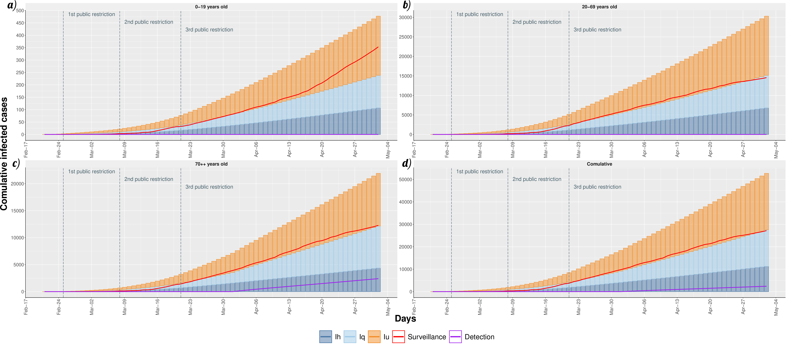

  
```{r, include = FALSE}
knitr::opts_chunk$set(
  collapse = TRUE,
  comment = "#>"
  
  )
```
  
  
  
# COVID-19 model


```{r , echo = FALSE, message=FALSE, fig.align='center', fig.cap='\\label{fig:Pertussis_PN}',  fig.height = 4, fig.width = 6, fig.pos='H'}

knitr::include_graphics("./Figures/Model.png")
```
SEIRS model and surveillance data on Piedmont region.: (A) The age-dependent SEIRS model. (B) The total infected cases distributed in the counties of the Piedmont region. (C) Distribution of quarantine infected (Iq), hospitalized infected  (Ih) and deaths (D) from February 24th to May 2nd. The control strategies are reported below the bar graph.

# Repository structure

# Model Calibration

The calibration phase was performed to fit the model outcomes with  the surveillance  Piedmont infection and death data (from  February 24\textsuperscript{st}  to May 2nd\textsuperscript{st})  using  squared  error  estimator  via  trajectory matching.  Hence, a global optimization algorithm, based on  \emph{generalized simulated annealing method}~ @GenSA, was exploited to estimate 13 model parameters characterized by a high uncertainty due to their difficulty  of  being  empirically  measured.   


```{r , echo = FALSE, message=FALSE, fig.align='center', fig.cap='\\',  fig.height = 4, fig.width = 6, fig.pos='H'}

knitr::include_graphics("./Figures/Comulatives-1.png")
```

```{r , echo = FALSE, message=FALSE, fig.align='center', fig.cap='\\',  fig.height = 4, fig.width = 6, fig.pos='H'}


```


## Studying the effects of different population responses to government actions.

```{r , echo = FALSE, message=FALSE, fig.align='center', fig.cap='\\label{fig:AlphaVar}',  fig.height = 4, fig.width = 6, fig.pos='H'}

knitr::include_graphics("./Figures/DiffStrengths-1.png")
```


## COVID-19 epidemic containment strategies.


The daily evolution of infected individuals is shown varying on the columns the  the efficacy of individual-level measures and on the rows the efficacy of  community surveillance.

```{r , echo = FALSE, message=FALSE, fig.align='center', fig.cap='\\label{fig:Boxplot}',  fig.height = 4, fig.width = 6, fig.pos='H'}

knitr::include_graphics("./Figures/Plot3_withLine-1.png")
```


Specifically, in Figure~\ref{fig:Boxplot} we show the daily forecasts of the number of infected individuals with the efficacy of individual-level measures ranging from $0\%$ to $60\%$ on the columns (increasing by steps of $20\%$) and, on the rows,  increasing capability (from 0\% to 30\%, by 10\% steps) of identifying otherwise undetected infected individuals.
These results are obtained as median value of 5000 traces for each scenario obtained from the stochastic simulation.


# References
  
<div id="refs"></div>
  