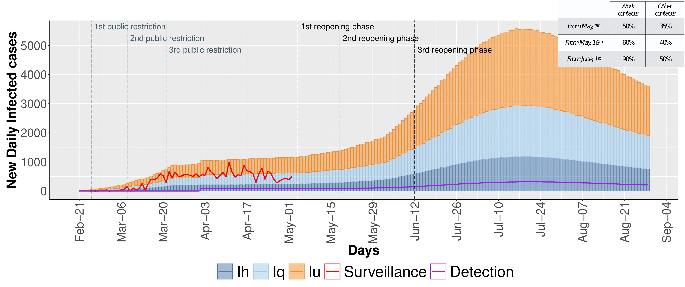
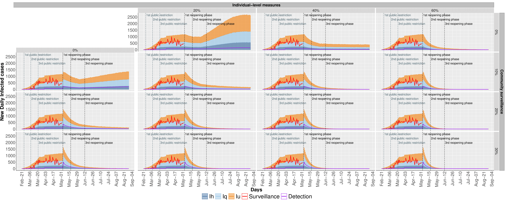

  
```{r, include = FALSE}
knitr::opts_chunk$set(
  collapse = TRUE,
  comment = "#>"
  
  )
```
  
# Workflow

All the reported experiments were performed using [Epimod](https://github.com/qBioTurin/epimod), a tool recently developed by our group to provide a general framework to draw and analyze epidemiological systems.
For more details regarding the workflow of analysis see [SIR](https://github.com/qBioTurin/SIR), where it is exploited the SIR model as a simple step by step guide of the package.

# Repository structure

Folders:

1. **Main**: here the two main R files are stored: 1) *run.R* where it is showed how to start, to calibrate the model and to run the main analysis; 2) *runDifferentScenario.R* where there are the 16 function calls for simulating the 16 scenarios pictured in Figures 5 and 6.
2. **net**: the PNPRO file corresponding to the Extended Stochastic Symmetric Net (ESSN) [@Pernice19]  exploited to model the COVID-19, and the solver (which should be generated before starting the analysis) are stored;
3. **cpp**: the C++ code regarding the general transition of the ESSN;
4. **R_func**: here are stored all the R scripts to generate the plots and to run the analysis;
5. **input**: contains all the csv file (e.g., reference, parameter lists) necessary to run the analysis;
6. **Plot**: contains the plots showed in the main paper.

# COVID-19 model

```{r , echo = FALSE, message=FALSE, fig.align='center',  fig.height = 4, fig.width = 6, fig.pos='H', fig.cap="Fig.1) SEIRS model and surveillance data on Piedmont region."}

knitr::include_graphics("./Figures/Model.png")
```

In Figure 1 is showed: 

(A) The age-dependent SEIRS model. 
(B) The total infected cases distributed in the counties of the Piedmont region. 
(C) Distribution of quarantine infected (Iq), hospitalized infected  (Ih) and deaths (D) from February 24th to May 2nd. The control strategies are reported below the bar graph.

The population of the age class $i$ is  partitioned in the following  seven compartments: \emph{susceptible} ($S_i$), \emph{exposed} ($E_i$),  \emph{undetected infected}($I_{ui}$), \emph{quarantined infected} ($I_{qi}$), \emph{hospitalized infected} ($I_{hi}$), \emph{recovered} ($R_i$), \emph{dead} ($D_i$). 
With respect to the classical SEIRS model, we have added a transition from $I_{ui}$ to ${I_{qi}}$  to model the possibility to identify undetected cases and isolate them. In this way an individual in $I_{ui}$ tested as positive to the SARS-CoV-2 swab will be moved in the quarantine regime, $I_{qi}$. 

A  detailed  description  of  the  model (e.g., system of ordinary differential equations, parameters, etc) is  reported  in  the Supplementary Material.

# Model Calibration

The calibration phase was performed to fit the model outcomes with  the surveillance  Piedmont infection and death data (from  February 24st  to May 2nd)  using  squared  error  estimator  via  trajectory matching.  Hence, a global optimization algorithm, based on  \emph{generalized simulated annealing method} [@GenSA], was exploited to estimate 13 model parameters characterized by a high uncertainty due to their difficulty  of  being  empirically  measured:

1. three parameters represent the probability of infection for each age class, 
2. four parameters reflect the governmental action strength,
3. one parameter describes the intensity of the population response,
4. two parameters represent the  death rate for the hospitalized patients,
5. two parameters are the initial condition for the undetected and quarantine infected individuals,
6. the remainder parameter represents the detection rate for the third age class starting from the $1^{st}$ April.

Consistently, Figure 2A and 2B show that the calibrated model is able to mimic consistently the observed infected and death cases (red line respectively). In details, Figure 2A reports  the  cumulative trend of the infected individuals in which the undetected infected  are showed in orange, the quarantine infected  in light blue, and hospitalized infected in blue. The purple line reports  the cumulative trend of the undetected cases diagnosed by  SARS-CoV-2 swab tests. Differently  Figure 2B shows the cumulative trend of deaths. In both histograms the surveillance data are reported as red line. Similarly, in Figure 3  the infected individuals for each age class are shown.


```{r , echo = FALSE, message=FALSE, fig.align='center', fig.cap='Fig.2) Number of (A) infected and (B) deceased individuals. ',  fig.height = 4, fig.width = 6, fig.pos='H'}

knitr::include_graphics("./Figures/Comulatives-1.png")
```

```{r , echo = FALSE, message=FALSE, fig.align='center', fig.cap='Fig.3) Number of infected individuals for each age class. The red curve represents the surveillance data, which does not account for undetected cases.',  fig.height = 4, fig.width = 6, fig.pos='H'}

knitr::include_graphics("./Figures/InfectsHistALL-1.png")
```


## Studying the effects of the government control interventions.

Three scenarios are implemented. In the \emph{First scenario} the model is calibrated to fit the surveillance data (yellow). In the \emph{Second scenario} the model extends the second restriction beyond March, $21^{st}$ without implementing the third restriction (blue). In the \emph{Third scenario} the model consider a higher population compliance to the third governmental restriction (green).

```{r , echo = FALSE, message=FALSE, fig.align='center', fig.cap='Fig.4) Stochastic simulation results reported as traces (on the left) and as density distributions (on the right).',  fig.height = 4, fig.width = 6, fig.pos='H'}

knitr::include_graphics("./Figures/DiffStrengths-1.png")
```


## COVID-19 epidemic containment strategies.

The daily evolution of infected individuals is shown varying on the columns the  the efficacy of individual-level measures and on the rows the efficacy of  community surveillance.

```{r , echo = FALSE, message=FALSE, fig.align='center', fig.cap=c('Fig.5) Pessimistic scenario in which the gradual reopening is not counterbalanced by any infection-control strategies', 'Fig.6) The daily evolution of infected individuals is shown varying on the columns the  the efficacy of individual-level measures and on the rows the efficacy of  community surveillance' ),  fig.height = 4, fig.width = 6, fig.pos='H'}


```
Figure 5 shows the daily evolution of infected individuals computed by the stochastic simulation. The stacked bars report the undetected infected (orange), the quarantine infected (light blue), and hospitalized infected (blue). The red line shows the trend of the infected cases from surveillance data. The purple line reports the cumulative trend of the undetected cases diagnosed by SARS-CoV-2 swab tests.
In Figure 6 we show the daily forecasts of the number of infected individuals with the efficacy of individual-level measures ranging from $0\%$ to $60\%$ on the columns (increasing by steps of $20\%$) and, on the rows,  increasing capability (from 0\% to 30\%, by 10\% steps) of identifying otherwise undetected infected individuals. These results are obtained as median value of 5000 traces for each scenario obtained from the stochastic simulation.


# References
  
<div id="refs"></div>
  