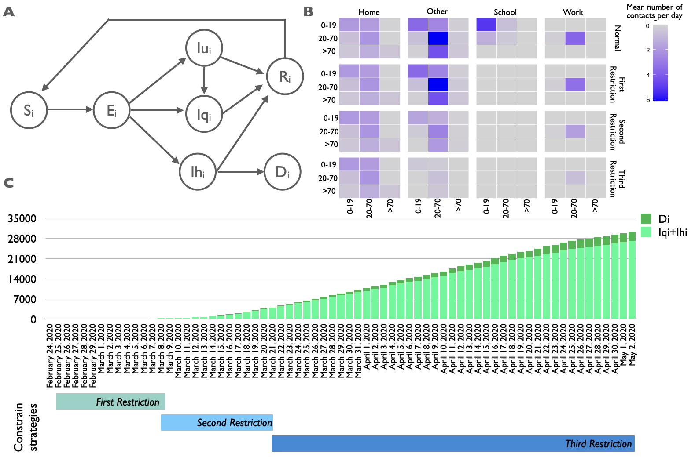
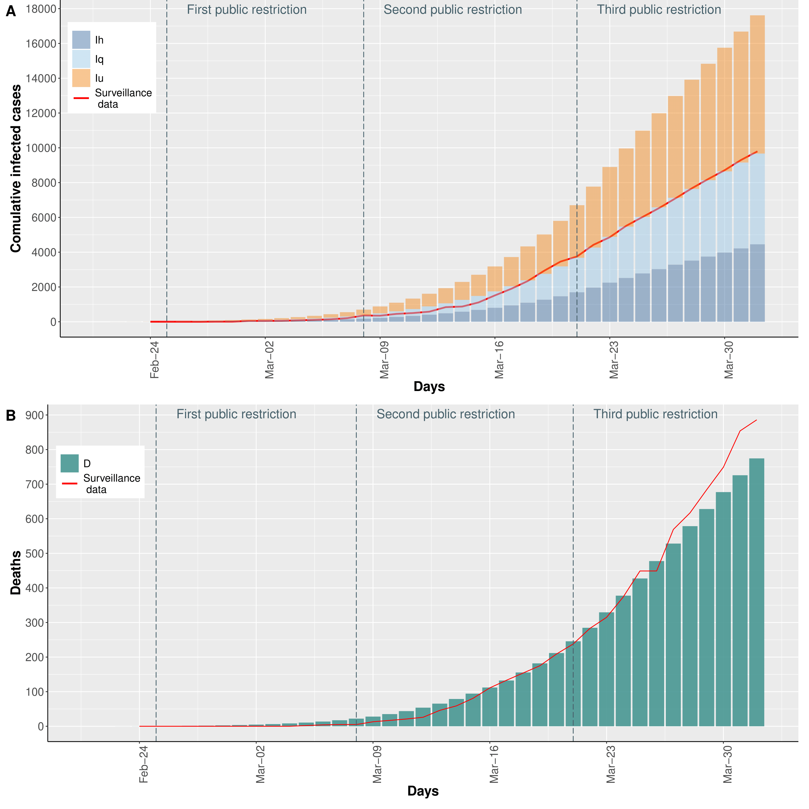
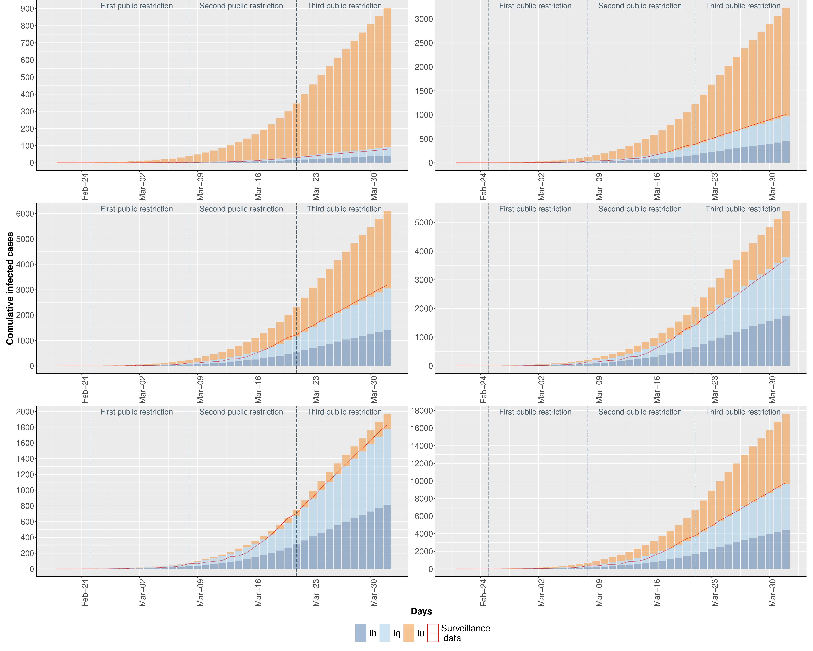
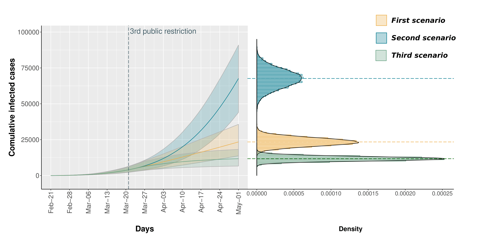
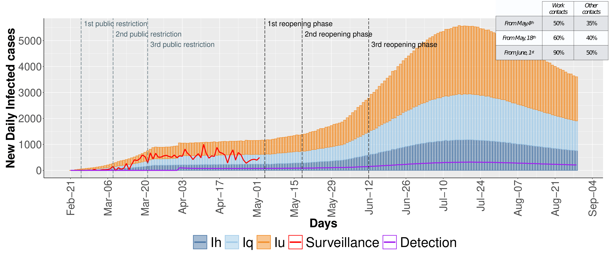
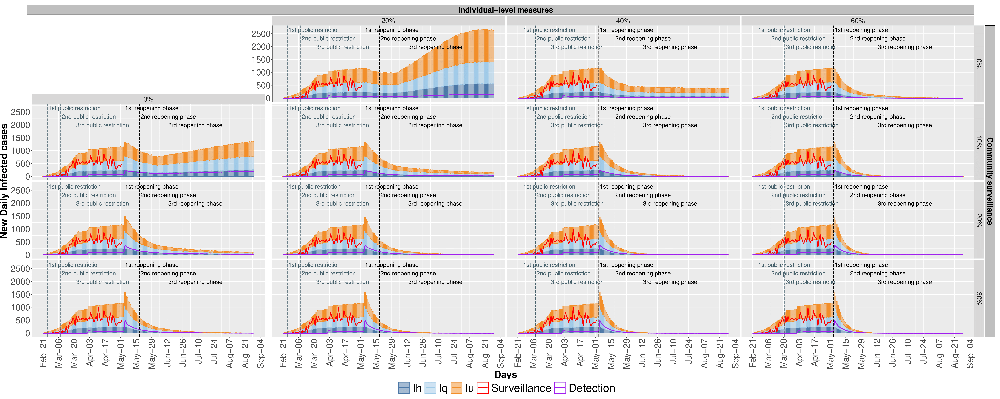

-   [Workflow](#workflow)
-   [Repository structure](#repository-structure)
-   [COVID-19 model](#covid-19-model)
-   [Model Calibration](#model-calibration)
    -   [Studying the effects of the government control
        interventions.](#studying-the-effects-of-the-government-control-interventions.)
    -   [COVID-19 epidemic containment
        strategies.](#covid-19-epidemic-containment-strategies.)
-   [References](#references)

Workflow
========

All the reported experiments were performed using
[Epimod](https://github.com/qBioTurin/epimod), a tool recently developed
by our group to provide a general framework to draw and analyze
epidemiological systems. For more details regarding the workflow of
analysis see [SIR](https://github.com/qBioTurin/SIR), where it is
exploited the SIR model as a simple step by step guide of the package.

Repository structure
====================

Folders:

1.  **Main**: here the two main R files are stored: 1) *run.R* where it
    is showed how to start, to calibrate the model and to run the main
    analysis; 2) *runDifferentScenario.R* where there are the 16
    function calls for simulating the 16 scenarios pictured in Figures 5
    and 6.
2.  **net**: the PNPRO file corresponding to the Extended Stochastic
    Symmetric Net (ESSN) (Pernice et al. 2019) exploited to model the
    COVID-19, and the solver (which should be generated before starting
    the analysis) are stored;
3.  **cpp**: the C++ code regarding the general transition of the ESSN;
4.  **R\_func**: here are stored all the R scripts to generate the plots
    and to run the analysis;
5.  **input**: contains all the csv file (e.g., reference, parameter
    lists) necessary to run the analysis;
6.  **Plot**: contains the plots showed in the main paper.

COVID-19 model
==============

Fig.1) SEIRS model and surveillance data on Piedmont region.

In Figure 1 is showed:

1.  The age-dependent SEIRS model.
2.  The total infected cases distributed in the counties of the Piedmont
    region.
3.  Distribution of quarantine infected (Iq), hospitalized infected (Ih)
    and deaths (D) from February 24th to May 2nd. The control strategies
    are reported below the bar graph.

The population of the age class *i* is partitioned in the following
seven compartments: (*S**i*), (*E**i*),
(*I**u**i*), (*I**q**i*), (*I**h**i*),
(*R**i*), (*D**i*). With respect to the classical
SEIRS model, we have added a transition from *I**u**i* to
*I**q**i* to model the possibility to identify undetected
cases and isolate them. In this way an individual in
*I**u**i* tested as positive to the SARS-CoV-2 swab will be
moved in the quarantine regime, *I**q**i*.

A detailed description of the model (e.g., system of ordinary
differential equations, parameters, etc) is reported in the
Supplementary Material.

Model Calibration
=================

The calibration phase was performed to fit the model outcomes with the
surveillance Piedmont infection and death data (from February 24st to
May 2nd) using squared error estimator via trajectory matching. Hence, a
global optimization algorithm, based on (Yang Xiang et al. 2012), was
exploited to estimate 13 model parameters characterized by a high
uncertainty due to their difficulty of being empirically measured:

1.  three parameters represent the probability of infection for each age
    class,
2.  four parameters reflect the governmental action strength,
3.  one parameter describes the intensity of the population response,
4.  two parameters represent the death rate for the hospitalized
    patients,
5.  two parameters are the initial condition for the undetected and
    quarantine infected individuals,
6.  the remainder parameter represents the detection rate for the third
    age class starting from the 1*s**t* April.

Consistently, Figure 2A and 2B show that the calibrated model is able to
mimic consistently the observed infected and death cases (red line
respectively). In details, Figure 2A reports the cumulative trend of the
infected individuals in which the undetected infected are showed in
orange, the quarantine infected in light blue, and hospitalized infected
in blue. The purple line reports the cumulative trend of the undetected
cases diagnosed by SARS-CoV-2 swab tests. Differently Figure 2B shows
the cumulative trend of deaths. In both histograms the surveillance data
are reported as red line. Similarly, in Figure 3 the infected
individuals for each age class are shown.

Fig.2) Number of (A) infected and (B) deceased individuals.

Fig.3) Number of infected individuals for each age class. The red curve
represents the surveillance data, which does not account for undetected
cases.

Studying the effects of the government control interventions.
-------------------------------------------------------------

Three scenarios are implemented. In the the model is calibrated to fit
the surveillance data (yellow). In the the model extends the second
restriction beyond March, 21*s**t* without implementing the
third restriction (blue). In the the model consider a higher population
compliance to the third governmental restriction (green).

Fig.4) Stochastic simulation results reported as traces (on the left)
and as density distributions (on the right).

COVID-19 epidemic containment strategies.
-----------------------------------------

The daily evolution of infected individuals is shown varying on the
columns the the efficacy of individual-level measures and on the rows
the efficacy of community surveillance.

Fig.5) Pessimistic scenario in which the gradual reopening is not
counterbalanced by any infection-control strategies

Fig.6) The daily evolution of infected individuals is shown varying on
the columns the the efficacy of individual-level measures and on the
rows the efficacy of community surveillance

Figure 5 shows the daily evolution of infected individuals computed by
the stochastic simulation. The stacked bars report the undetected
infected (orange), the quarantine infected (light blue), and
hospitalized infected (blue). The red line shows the trend of the
infected cases from surveillance data. The purple line reports the
cumulative trend of the undetected cases diagnosed by SARS-CoV-2 swab
tests. In Figure 6 we show the daily forecasts of the number of infected
individuals with the efficacy of individual-level measures ranging from
0% to 60% on the columns (increasing by steps of 20%) and, on the rows,
increasing capability (from 0% to 30%, by 10% steps) of identifying
otherwise undetected infected individuals. These results are obtained as
median value of 5000 traces for each scenario obtained from the
stochastic simulation.

References
==========

Pernice, S., M. Pennisi, G. Romano, A. Maglione, S. Cutrupi, F.
Pappalardo, G. Balbo, M. Beccuti, F. Cordero, and R. A. Calogero. 2019.
“A Computational Approach Based on the Colored Petri Net Formalism for
Studying Multiple Sclerosis.” *BMC Bioinformatics*.

Yang Xiang, Sylvain Gubian, Brian Suomela, and Julia Hoeng. 2012.
“Generalized Simulated Annealing for Efficient Global Optimization: The
GenSA Package for R.” *The R Journal*. <http://journal.r-project.org/>.
