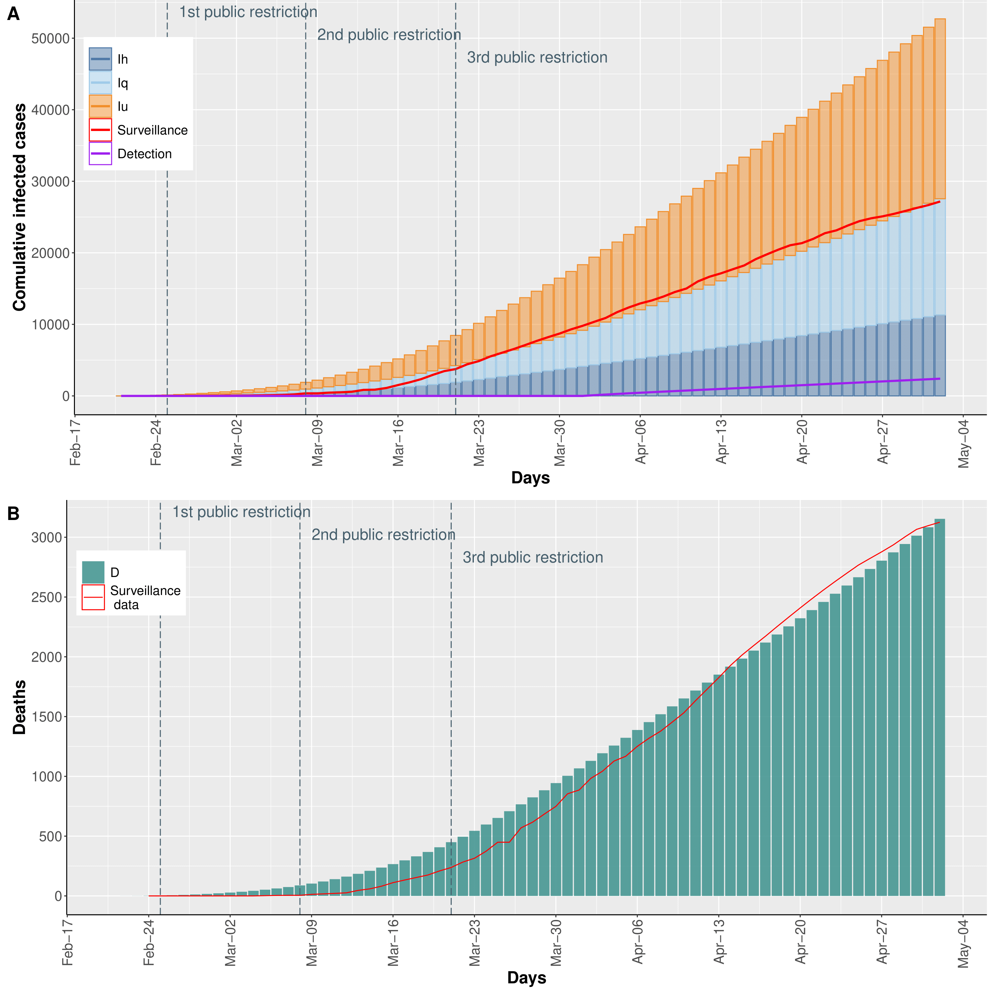

-   [COVID-19 model](#covid-19-model)
-   [Starting](#starting)
-   [Model Calibration](#model-calibration)
-   [References](#references)

COVID-19 model
==============

 SEIR model and surveillance data on Piedmont region.: (A) The
age-dependent SEIR model. (B) The total infected cases distributed in
the counties of the Piedmont region. (C) Distribution of quarantine
infected (Iq), hospitalized infected (Ih) and deaths (D) from February
24th to March 28th. The control strategies are reported below the bar
graph.

Starting
========

Model Calibration
=================

The calibration phase was performed to fit the model outcomes with the
surveillance Piedmont infection and death data (from February 24 to
April 1) using squared error estimator via trajectory matching. Hence, a
global optimization algorithm, based on ~, was exploited to estimate 23
model parameters characterized by a high uncertainty due to their
difficulty of being empirically measured.  
In particular, 15 parameters represent the infection rates (i.e.,
*β**i*, *j*), three parameters reflect the governmental
action strength and the related population response at time epoch *t*
(i.e., *α*(*t*) with
$t\\in \\{\\ \\text{February 25\\textsuperscript{th}},\\text{March 8\\textsuperscript{th}}, \\text{March 21\\textsuperscript{st}}\\}$),
%$\\alpha(\\text{February 25\\textsuperscript{th}})=0.211, \\, \\alpha(\\text{March 8\\textsuperscript{th}})=0.549$
and $\\alpha(\\text{March %21\\textsuperscript{st}})=0.738$)}, one
parameter describes the intensity of the population response (i.e.,
*k*), and the remainders four parameters represent the death rate for
the hospitalized patients (i.e., *σ**i*, fixing
*σ*1 = 0).

Therefore, the model calibration was carried out considering the
proportion between undetected and detected infected individuals (i.e.,
given by the sum of the quarantined and hospitalized infected
individuals) to be one-to-one on average as reported in (refer to
Section S2 in the Supplementary Material for the definition of the
distribution of infected categories by age). According to this scenario
and to , we assumed that the initial system state is:
*S*1 = 733130, *S*2 = 881208, *S*3 = 1340552, *S*4 = 1038395, *S*5 = 363121, *I**q*2 = 1, *I**q*3 = 1, *I**q*4 = 1, *I**u*2 = 1, *I**u*3 = 1, *I**u*4 = 1,
while all the other compartments are set to zero. Moreover, the
availability of social interaction for the infectious sub-classes is
fixed to *η**u* = 1, *η**q* = 0.3 and
*η**h* = 0.1. Finally, the rates at which an exposed
individual with age *i* becomes an infected individual in sub-class *ν*
(i.e., *λ**i*, *ν*) are derived by the surveillance data as
described in supplementary material.

&lt;/p&gt;

&lt;/p&gt;

&lt;/p&gt;

&lt;/p&gt;

&lt;/p&gt;

References
==========
